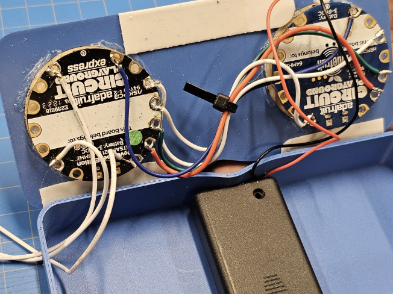

---
## The problem:
  * Roommates often forget to complete their assigned chores in time leading to disorganized living spaces.
  * Simple manual methods of tracking can be hard to manage.
  * People can claim to have completed a task without doing it.
  * Ineffective task management can lead to conflicts between roommates.

## Our Solution:
__AN AUTOMATED CHORE TRAKING SYSTEM__

  * The device syncs with the user’s phone to keep track of when chores are completed.
  * The device includes a timer to prevent users cheating the system and make sure they actually do the chores.
  * User-friendly interface for easy implementation of task management system.
  * Sensor detects when a cleaning implement has been picked up.

## CAD Design:
__Face plates indicate the time in 5 min intervals and user connections__

|The clock face                         |  The bluetooth device face                  |
|:-------------------------------------:|:--------------------------------------:     |
|  |  |

<br/><br/>

*Case holds two Adafruits for users and timer.Square case has space at the bottom to hold battery pack*

<br/><br/>

*Finished Design*

<br/><br/>

## Hardware:


*The connections inside the device and in between the 2 modules*

<br/><br/>


*Inside the casing*
<br/><br/>

## C++ Code:
```C++
s = "Python syntax highlighting"
print s
```
<br/><br/>
## Python Code:
```python
s = "Python syntax highlighting"
print s
```
<br/><br/>
## Demo Video:
__Click on the image to watch the youtube video__

<a href="http://www.youtube.com/watch?feature=player_embedded&v=xfMjQpl58Fs" target="_blank">
 
</a>

