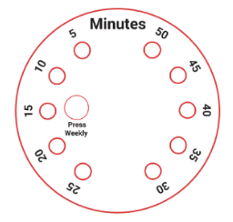

---
## The problem:
  * Roommates often forget to complete their assigned chores in time leading to disorganized living spaces.
  * Simple manual methods of tracking can be hard to manage.
  * People can claim to have completed a task without doing it.
  * Ineffective task management can lead to conflicts between roommates.

## Our Solution:
__AN AUTOMATED CHORE TRAKING SYSTEM__

  * The device syncs with the user’s phone to keep track of when chores are completed.
  * The device includes a timer to prevent users cheating the system and make sure they actually do the chores.
  * User-friendly interface for easy implementation of task management system.
  * Sensor detects when a cleaning implement has been picked up.

## CAD Design:
__Face plates indicate the time in 5 min intervals and user connections__

|The clock face                         |  The bluetooth device face                  |
|:-------------------------------------:|:--------------------------------------:     |
|  |  |

<br/><br/>

*Case holds two Adafruits for users and timer.Square case has space at the bottom to hold battery pack*

<br/><br/>

*Finished Design*

<br/><br/>

## Hardware:


*The connections inside the device and in between the 2 modules*

<br/><br/>


*Inside the casing*
<br/><br/>

## C++ Code:
```C++
hello
```
<br/><br/>
## Python Code:
```python
#include <Arduino.h> // importing libraries
#include <bluefruit.h>
#include <Adafruit_CircuitPlayground.h>


BLEUart bleuart; // initializing a Bluetooth UART instance for the app to connect to

char BTdevName[32] = {};// bringing the dveice name out of the scope of the specific function so we can access it later
String BTdevStr;

String profiles[10] = {" ", " ", " ", " ", " ", " ", " ", " ", " ", " "}; // initializing an empty list to store known profiles


void setup(){
  Serial.begin(9600); // initializing serial communication to monitor the output
  while ( !Serial ) delay(10); // boilerplate compatibility stuff 
  Bluefruit.begin(); // initializing the on board Bluetooth module
  Bluefruit.setTxPower(4); // setting the Transmission power of the module 

  Bluefruit.Periph.setConnectCallback(connect_callback); // getting some data(calling back) from the connected device i.e. in this case, the name
  
  bleuart.begin(); // starting the BT UART interface
  CircuitPlayground.begin();

  startAdv(); // making the Bluetooth device discoverable and ready to pair
}


void startAdv(void){
  Bluefruit.Advertising.addFlags(BLE_GAP_ADV_FLAGS_LE_ONLY_GENERAL_DISC_MODE); // setting flags so that the app knows what the device is
  Bluefruit.Advertising.addTxPower(); 
  
  Bluefruit.Advertising.addService(bleuart); // setting the bluetooth module to a mode where it can connect to the app
  
  Bluefruit.ScanResponse.addName();

  Bluefruit.Advertising.restartOnDisconnect(true); // refreshes the BT module when device disconnects
  Bluefruit.Advertising.setInterval(32, 244); // refresh rate of the Bluetooth scan
  Bluefruit.Advertising.setFastTimeout(30); // connection timeout to prevent infinite loops
  Bluefruit.Advertising.start(0); 
}


void connect_callback(uint16_t conn_handle){
  BLEConnection* connection = Bluefruit.Connection(conn_handle);
  char central_name[32] = { 0 }; // local variable to store the name
  connection->getPeerName(central_name, sizeof(central_name)); // getting the name of the connected device
  connection->getPeerName(BTdevName, sizeof(BTdevName)); 
  BTdevStr = BTdevName; // converting the name into a string

  Serial.println(BTdevStr); // printing the name of the device for testing
  if(CircuitPlayground.slideSwitch()){ // checking if the slide switch on the board is set to register mode
    
    for(int i; i<10; i++) { // iterating through the list of profiles to find an empty index
      
      if(String(profiles[i]) == " "){ // checking if the current index is empty
        
        profiles[i] = BTdevStr; // setting the currently connected bluetooth device to the empty index
        Serial.println("registered"); // printing for testing
        break; // breaking out of the loop
      }
      else{
      }
    }
  }
  else{ // if the slide switch is set to regular operation mode
    
    for(int i; i<10; i++) { // iterating through the list of known profiles
      
      if(String(profiles[i]) == BTdevStr){ // checking if the currently connected device is registered
        
        Serial.println("found"); // print statement for testing 
        Serial.println(i); // this will get passed on to the other device
      }
      else{
      }
  }
 }
}

void loop(){}
```
<br/><br/>
## Demo Video:
__Click on the image to watch the youtube video__

<a href="http://www.youtube.com/watch?feature=player_embedded&v=xfMjQpl58Fs" target="_blank">
 
</a>

